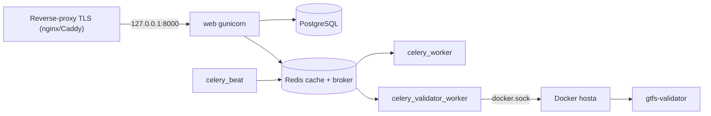

# Wdrożenie produkcyjne (Docker Compose)

Kompleksowa instrukcja uruchomienia projektu na produkcji: aplikacja Django + Celery,
PostgreSQL, Redis, walidator GTFS oraz reverse-proxy z TLS.

Środowisko docelowe: **pojedynczy VPS**, Docker Compose, ruch HTTPS terminowany na
zewnętrznym reverse-proxy (nginx/Caddy). Aplikacja nasłuchuje lokalnie na
`127.0.0.1:8000` i nie jest wystawiona bezpośrednio do internetu.

> Development: do pracy lokalnej użyj `docker compose up --build` (patrz `README.md`).
> Ten dokument dotyczy konfiguracji **produkcyjnej** (`settings_prod` + gunicorn).

---

## Spis treści

1. [Architektura usług](#1-architektura-usług)
2. [Wymagania wstępne](#2-wymagania-wstępne)
3. [Pobranie kodu](#3-pobranie-kodu)
4. [Generowanie sekretów](#4-generowanie-sekretów)
5. [Plik `.env` — pełna konfiguracja](#5-plik-env--pełna-konfiguracja)
6. [PostgreSQL](#6-postgresql)
7. [CORS i CSRF](#7-cors-i-csrf)
8. [Docker socket dla walidatora (DOCKER_GID)](#8-docker-socket-dla-walidatora-docker_gid)
9. [Uprawnienia plików (UID/GID)](#9-uprawnienia-plików-uidgid)
10. [Uruchomienie](#10-uruchomienie)
11. [Migracje, konto admina i role](#11-migracje-konto-admina-i-role)
12. [Pliki statyczne (STATIC)](#12-pliki-statyczne-static)
13. [Reverse-proxy + TLS](#13-reverse-proxy--tls)
14. [Weryfikacja wdrożenia](#14-weryfikacja-wdrożenia)
15. [Aktualizacje](#15-aktualizacje)
16. [Kopie zapasowe i odtwarzanie](#16-kopie-zapasowe-i-odtwarzanie)
17. [Checklista bezpieczeństwa](#17-checklista-bezpieczeństwa)
18. [Troubleshooting](#18-troubleshooting)

---

## 1. Architektura usług

Plik `docker-compose.yml` (baza) + `docker-compose.prod.yml` (nakładka produkcyjna)
definiują następujące usługi:

| Usługa | Rola | Port (host) |
| --- | --- | --- |
| `web` | Django (gunicorn w prod) | `127.0.0.1:8000` |
| `postgres` | Baza danych | `127.0.0.1:5420` (tylko lokalnie) |
| `redis` | Broker Celery + cache | `127.0.0.1:6379` (tylko lokalnie) |
| `celery_worker` | Kolejka `default` | — |
| `celery_validator_worker` | Kolejka `feeds` + walidator GTFS (docker.sock) | — |
| `celery_beat` | Harmonogram (django-celery-beat) | — |
| `gtfs-realtime-validator` | Walidator GTFS-RT | `127.0.0.1:8082` |
| `migrate` / `init_uploads` | Zadania startowe (jednorazowe) | — |



---

## 2. Wymagania wstępne

- Linux VPS (np. Debian/Ubuntu) z publicznym IP i domeną wskazującą na ten serwer.
- Docker Engine + plugin `docker compose` (v2).
- Otwarte porty `80` i `443` (dla reverse-proxy). Porty bazy/redis/web **nie** powinny
  być wystawione publicznie (w compose są zbindowane do `127.0.0.1`).
- Dostęp do `/var/run/docker.sock` na hoście (wymagany przez walidator GTFS).

---

## 3. Pobranie kodu

```bash
git clone <adres-repozytorium> /opt/odt
cd /opt/odt
```

---

## 4. Generowanie sekretów

Wszystkie poniższe wartości wygeneruj **raz** i zapisz w menedżerze sekretów.

```bash
# DJANGO_SECRET_KEY (długi, losowy klucz)
python3 -c "import secrets; print(secrets.token_urlsafe(64))"

# FEED_AUTH_ENCRYPTION_KEY (klucz Fernet do szyfrowania poświadczeń feedów)
python3 -c "from cryptography.fernet import Fernet; print(Fernet.generate_key().decode())"
# (jeśli nie masz lokalnie 'cryptography', wygeneruj w kontenerze po pierwszym buildzie:
#  docker compose run --rm web python -c "from cryptography.fernet import Fernet; print(Fernet.generate_key().decode())")

# POSTGRES_PASSWORD (silne hasło bazy)
python3 -c "import secrets; print(secrets.token_urlsafe(32))"

# GID grupy docker.sock na tym hoście (potrzebne walidatorowi)
stat -c '%g' /var/run/docker.sock
```

> Uwaga: `FEED_AUTH_ENCRYPTION_KEY` szyfruje klucze API/tokeny feedów „at rest”.
> Jeśli go nie ustawisz, poświadczenia zapiszą się **plaintextem** (tryb dev). Po
> ustawieniu klucza **nie zmieniaj go** — istniejące zaszyfrowane wartości stracą
> możliwość odszyfrowania.

---

## 5. Plik `.env` — pełna konfiguracja

Skopiuj szablon i wypełnij realnymi wartościami:

```bash
cp .env.example .env
chmod 600 .env        # ogranicz dostęp do pliku z sekretami
```

Pełny, produkcyjny przykład `.env` (zastąp wartości własnymi):

```dotenv
# ───────────────────────── Django ─────────────────────────
DJANGO_SETTINGS_MODULE=OtwarteDaneTransportowe.settings_prod
DJANGO_SECRET_KEY=<wklej-wygenerowany-secret-key>
DJANGO_ALLOWED_HOSTS=api.example.org
# 127.0.0.1 i localhost są dodawane automatycznie w settings_prod (healthcheck).
# TLS terminuje reverse-proxy — redirect w Django jest domyślnie wyłączony:
# DJANGO_SECURE_SSL_REDIRECT=False
# DJANGO_SECURE_HSTS_SECONDS=31536000
# DJANGO_LOG_LEVEL=INFO

# ───────────────────────── PostgreSQL ─────────────────────────
POSTGRES_DB=otwarte_dane_transportowe
POSTGRES_USER=odt
POSTGRES_PASSWORD=<wklej-silne-haslo-bazy>
# Port wystawiany na hoście (tylko 127.0.0.1). Można pominąć w prod.
POSTGRES_HOST_PORT=5420

# ───────────────────────── Redis (broker + cache) ─────────────────────────
REDIS_HOST_PORT=6379
# Współdzielony cache (lock realtime + throttling). NIE zmieniaj nazwy hosta:
REDIS_CACHE_URL=redis://redis:6379/2

# ───────────────────────── CORS / CSRF ─────────────────────────
# Origins frontu (schemat + host, bez ścieżki), oddzielone przecinkami:
CORS_ALLOWED_ORIGINS=https://www.example.org,https://example.org
# Które ścieżki podlegają regułom CORS:
CORS_URLS_REGEX=^/(api|feed)/.*$
# (opcjonalnie) dodatkowe regexy origin — w prod localhost NIE jest dozwolony automatycznie:
# CORS_ALLOWED_ORIGIN_REGEXES=
# Origins zaufane dla CSRF (POST za proxy TLS) — pełne scheme://host:
CSRF_TRUSTED_ORIGINS=https://api.example.org

# ───────────────────────── Szyfrowanie poświadczeń feedów ─────────────────────────
FEED_AUTH_ENCRYPTION_KEY=<wklej-klucz-Fernet>

# ───────────────────────── Walidator GTFS (Docker socket) ─────────────────────────
DOCKER_GID=<wynik: stat -c '%g' /var/run/docker.sock>
# Limity zasobów kontenera walidatora:
# GTFS_VALIDATOR_MEM_LIMIT=2g
# GTFS_VALIDATOR_PIDS_LIMIT=512
# GTFS_VALIDATOR_NANO_CPUS=2000000000   # 2 vCPU (1e9 = 1 rdzeń)
GTFS_REALTIME_VALIDATOR_HOST_PORT=8082

# ───────────────────────── Uprawnienia plików ─────────────────────────
UID=1000
GID=1000
HOST_PROJECT_PATH=/opt/odt
HOST_MEDIA_ROOT=/opt/odt/uploaded_data

# ───────────────────────── Wydajność / Celery / gunicorn ─────────────────────────
GUNICORN_WORKERS=3
CELERY_DEFAULT_CONCURRENCY=2
CELERY_FEEDS_CONCURRENCY=2

# ───────────────────────── Limity / throttling / JWT (opcjonalne) ─────────────────────────
# MAX_FEED_FILE_SIZE_BYTES=209715200      # 200 MB
# MAX_IMAGE_FILE_SIZE_BYTES=10485760       # 10 MB
# DATA_UPLOAD_MAX_MEMORY_SIZE=10485760
# FILE_UPLOAD_MAX_MEMORY_SIZE=5242880
# THROTTLE_ANON=60/min
# THROTTLE_USER=240/min
# THROTTLE_LOGIN=10/min
# THROTTLE_FEED_DOWNLOAD=120/min
# JWT_ACCESS_MINUTES=15
# JWT_REFRESH_DAYS=1

# ───────────────────────── Reverse-proxy (limit zaufania XFF) ─────────────────────────
# CIDR-y zaufanego proxy (np. sieć dockerowa lub adres proxy) — dla limitu reakcji bloga:
# TRUSTED_PROXY_CIDRS=172.16.0.0/12

# ───────────────────────── Publiczny URL (opcjonalnie, dla walidacji GTFS-RT) ─────────────────────────
# PUBLIC_BASE_URL=https://api.example.org
```

### Najważniejsze zmienne — opis

| Zmienna | Znaczenie |
| --- | --- |
| `DJANGO_SETTINGS_MODULE` | **Musi** być `...settings_prod` na produkcji. |
| `DJANGO_SECRET_KEY` | Aplikacja **odmówi startu** w prod, jeśli to placeholder. |
| `DJANGO_ALLOWED_HOSTS` | Publiczne domeny API (bez `https://`). `127.0.0.1` i `localhost` są dodawane automatycznie w `settings_prod`. |
| `POSTGRES_PASSWORD` | Hasło bazy — silne, unikalne. |
| `CORS_ALLOWED_ORIGINS` | Origins przeglądarkowe frontu (whitelist). |
| `CSRF_TRUSTED_ORIGINS` | Wymagane do POST za proxy TLS. |
| `FEED_AUTH_ENCRYPTION_KEY` | Szyfrowanie poświadczeń feedów at-rest. |
| `DOCKER_GID` | GID `docker.sock` — bez tego walidator GTFS nie zadziała. |
| `REDIS_CACHE_URL` | Współdzielony cache (lock realtime + throttling). |

---

## 6. PostgreSQL

- W sieci Dockera aplikacja łączy się przez `POSTGRES_HOST=postgres:5432` (ustawione
  na sztywno w compose). Zmienne `POSTGRES_DB/USER/PASSWORD` są wstrzykiwane do obu:
  kontenera bazy i aplikacji.
- Na hoście baza jest wystawiona tylko na `127.0.0.1:${POSTGRES_HOST_PORT:-5420}`
  (niewidoczna z internetu). W prod możesz całkiem usunąć mapowanie portu, jeśli nie
  potrzebujesz dostępu z hosta.
- Dane trzymane są w wolumenie `odt_pgdata` (przeżywa restart/odtworzenie kontenerów).

### Zmiana hasła istniejącej bazy

Jeśli zmieniasz `POSTGRES_PASSWORD` **po** pierwszym uruchomieniu, samo zmienne
środowiskowe nie zmieni hasła w już zainicjalizowanym wolumenie. Wykonaj:

```bash
docker compose exec postgres psql -U "$POSTGRES_USER" -d "$POSTGRES_DB" \
  -c "ALTER USER \"$POSTGRES_USER\" WITH PASSWORD 'NOWE_HASLO';"
# następnie zaktualizuj .env i zrestartuj usługi aplikacji
```

### Tuning (opcjonalnie)

Dla większych wdrożeń rozważ ustawienie `shared_buffers`, `work_mem` itp. przez
`command:` lub zamontowanie własnego `postgresql.conf`. Domyślny obraz `postgres:16`
jest wystarczający na start.

---

## 7. CORS i CSRF

CORS jest obsługiwany przez `django-cors-headers`. Reguły:

- **`CORS_ALLOWED_ORIGINS`** — lista dozwolonych originów frontu (schemat + host),
  np. `https://www.example.org`. To główny mechanizm whitelisty w produkcji.
- **`CORS_URLS_REGEX`** — które ścieżki podlegają CORS. Domyślnie `^/(api|feed)/.*$`.
- **`CORS_ALLOWED_ORIGIN_REGEXES`** — w produkcji **nie** dopuszcza automatycznie
  `localhost` (to zachowanie tylko w dev). Jeśli potrzebujesz wzorców, ustaw jawnie.
- **`CSRF_TRUSTED_ORIGINS`** — wymagane, by żądania POST z formularzy/sesji przechodziły
  weryfikację CSRF za proxy terminującym TLS. Podaj pełne `scheme://host`
  (np. `https://api.example.org`).

> Proxy **musi** przekazywać nagłówek `X-Forwarded-Proto: https` — aplikacja używa
> `SECURE_PROXY_SSL_HEADER`, by rozpoznać HTTPS. Bez tego ciasteczka `Secure` i CSRF
> mogą nie działać poprawnie.

---

## 8. Docker socket dla walidatora (DOCKER_GID)

Usługa `celery_validator_worker` uruchamia walidator GTFS jako kontener przez
zamontowany `/var/run/docker.sock`. Wymaga to dopasowania GID:

```bash
echo "DOCKER_GID=$(stat -c '%g' /var/run/docker.sock)" >> .env
```

> ⚠️ **Bezpieczeństwo:** dostęp do `docker.sock` jest równoważny rootowi na hoście.
> Złagodzenia są w miejscu (walidator: `network_disabled`, non-root, `--rm`, limity
> `mem/pids/cpu`). Rekomendacja produkcyjna: zastąpić surowy socket least-privilege
> proxy (np. `docker-socket-proxy` z dostępem tylko do create/start/wait/remove) albo
> wydzielić walidator do osobnego mikroserwisu. Patrz komentarz w `docker-compose.yml`.

---

## 9. Uprawnienia plików (UID/GID)

Katalog `uploaded_data/` jest montowany jako bind-mount. Aby uniknąć plików
własności roota:

- Ustaw `UID`/`GID` w `.env` na użytkownika, który ma być właścicielem
  (zwykle `1000:1000`). Aplikacja działa jako `${UID}:${GID}`.
- Usługa `init_uploads` automatycznie wykonuje `chown -R` na `uploaded_data/` przy
  starcie (`scripts/docker-init-uploads.sh`).
- `HOST_PROJECT_PATH` i `HOST_MEDIA_ROOT` muszą wskazywać **rzeczywiste ścieżki na
  hoście** (potrzebne walidatorowi do bind-mountów wejścia/wyjścia).

Sprawdzenie własnego UID/GID:

```bash
id -u   # UID
id -g   # GID
```

---

## 10. Uruchomienie

Produkcyjnie uruchamiamy z nałożeniem `docker-compose.prod.yml` (gunicorn +
`settings_prod`). Najprościej przez skrypt:

```bash
cp .env.example .env    # jeśli jeszcze nie masz .env
# uzupełnij .env (patrz sekcja 5), potem:
chmod +x scripts/deploy.sh
./scripts/deploy.sh up -d --build
./scripts/deploy.sh ps
```

Ręcznie (równoważne):

```bash
# Budowa obrazu i start w tle
docker compose -f docker-compose.yml -f docker-compose.prod.yml up -d --build
```

Aby nie powtarzać `-f` przy każdej komendzie, wyeksportuj:

```bash
export COMPOSE_FILE=docker-compose.yml:docker-compose.prod.yml
docker compose up -d --build
docker compose ps
```

> **Hasła i klucze w `.env`:** wartości są wczytywane przez `env_file`, więc mogą
> zawierać znak `$` bez podwójnego escapowania. Unikaj wpisywania sekretów jako
> `${POSTGRES_PASSWORD}` w plikach compose — to powodowało ostrzeżenia typu
> `The "o" variable is not set`.

Kolejność startu jest wymuszona zależnościami: `init_uploads` → `postgres`/`redis`
(healthcheck) → `migrate` → `web`/workery.

---

## 11. Migracje, konto admina i role

Migracje uruchamiają się automatycznie w usłudze `migrate` przy starcie. Grupy ról
(`Admin`, `Blogger`, `Editor`, `DataProvider`, `Helper`) są tworzone migracją
`cases/0004_create_auth_role_groups` — **nie trzeba** ich zakładać ręcznie.

Utwórz pierwsze konto administratora:

```bash
docker compose exec web python manage.py createsuperuser
```

Przypisanie ról robisz w panelu `/admin/` (Groups) albo przez API zarządzania
użytkownikami (`/api/users/`, wymaga grupy `Admin`).

Ręczne migracje (w razie potrzeby):

```bash
docker compose exec web python manage.py migrate
```

---

## 12. Pliki statyczne (STATIC)

Pliki statyczne (CSS/JS panelu `/admin/`, DRF oraz Swagger UI) są serwowane
bezpośrednio przez aplikację za pomocą **WhiteNoise** — nie wymagają osobnego
serwera plików. Konfiguracja:

- `STATIC_URL = '/static/'`, `STATIC_ROOT = staticfiles/` (`settings_base.py`).
- `whitenoise.middleware.WhiteNoiseMiddleware` tuż po `SecurityMiddleware`.
- `STATIC` jest **publiczny** (bez logowania) — to zamierzone, dotyczy wyłącznie
  zasobów front-endowych Django/DRF, nie danych użytkowników.

### Generowanie plików (`collectstatic`)

Obraz uruchamia `collectstatic` przy budowie, ale w dev/serwerowym trybie z
bind-mountem (`.:/app`) host **przesłania** katalog z obrazu. Dlatego usługa
`migrate` w `docker-compose.yml` uruchamia `collectstatic` przy **każdym** starcie:

```yaml
command: sh -c "python manage.py migrate && python manage.py collectstatic --noinput"
```

Dzięki temu po `git pull` + `up` pliki trafiają do `./staticfiles/` na hoście i są
widoczne dla WhiteNoise. W razie potrzeby można uruchomić ręcznie:

```bash
docker compose exec web python manage.py collectstatic --noinput
```

### STATIC vs MEDIA

| Ścieżka | Zawartość | Dostęp |
| --- | --- | --- |
| `/static/...` | CSS/JS admina, DRF, Swagger | Publiczny (WhiteNoise) |
| `/internal-media/blog/...` | Obrazki wpisów blogowych | Publiczny |
| `/internal-media/...` (feedy) | Pliki feedów | Tylko przez autoryzowane endpointy download |

### Weryfikacja

```bash
# Wewnątrz hosta (bezpośrednio do aplikacji)
curl -I http://127.0.0.1:8000/static/admin/css/base.css

# Przez reverse-proxy / domenę
curl -I https://api.example.org/static/admin/css/base.css
```

Oba powinny zwrócić **`200`**. Jeśli lokalnie `200`, a przez domenę `404` —
reverse-proxy nie przekazuje ścieżki `/static/` (patrz sekcja 13).

---

## 13. Reverse-proxy + TLS

Aplikacja nasłuchuje na `127.0.0.1:8000`. Przed nią postaw reverse-proxy z TLS.

### Wariant A: Caddy (automatyczny Let's Encrypt)

`/etc/caddy/Caddyfile`:

```caddy
api.example.org {
    reverse_proxy 127.0.0.1:8000 {
        header_up X-Forwarded-Proto {scheme}
        header_up X-Forwarded-For {remote_host}
    }
}
```

### Wariant B: nginx + certbot

```nginx
server {
    listen 443 ssl;
    server_name api.example.org;

    ssl_certificate     /etc/letsencrypt/live/api.example.org/fullchain.pem;
    ssl_certificate_key /etc/letsencrypt/live/api.example.org/privkey.pem;

    client_max_body_size 210m;   # >= MAX_FEED_FILE_SIZE_BYTES

    location / {
        proxy_pass http://127.0.0.1:8000;
        proxy_set_header Host              $host;
        proxy_set_header X-Real-IP         $remote_addr;
        proxy_set_header X-Forwarded-For   $proxy_add_x_forwarded_for;
        proxy_set_header X-Forwarded-Proto $scheme;   # WYMAGANE
    }
}

server {
    listen 80;
    server_name api.example.org;
    return 301 https://$host$request_uri;
}
```

> Ustaw `client_max_body_size` (nginx) z zapasem ponad `MAX_FEED_FILE_SIZE_BYTES`,
> inaczej proxy odrzuci duże uploady przed aplikacją.

Jeśli proxy nie działa na tym samym hoście co aplikacja, zmień bind portu `web`
w compose (`WEB_HOST_BIND` / `WEB_HOST_PORT`), tak aby był osiągalny dla proxy
(np. `WEB_HOST_BIND=0.0.0.0`).

> Proxy musi przekazywać **cały** ruch do aplikacji, w tym ścieżkę `/static/`
> (powyższy `location /` to zapewnia). Jeśli używasz wyłącznie reguł typu
> `location /api/`, pliki statyczne (CSS admina/Swaggera) nie dotrą do Django.

---

## 14. Weryfikacja wdrożenia

```bash
# Status i healthcheck usług
docker compose ps

# Logi aplikacji i workerów
docker compose logs -f web
docker compose logs -f celery_validator_worker

# Kontrola konfiguracji bezpieczeństwa (wewnątrz kontenera, prod)
docker compose exec web python manage.py check --deploy
```

Oczekiwane: brak ostrzeżeń `security.W*`. Następnie sprawdź przez przeglądarkę/proxy:

- `https://api.example.org/admin/` — panel logowania,
- `https://api.example.org/api/...` — odpowiedzi API,
- nagłówki HTTPS (HSTS) widoczne w odpowiedzi.

---

## 15. Aktualizacje

```bash
cd /opt/odt
git pull

# Przebuduj i odtwórz usługi (migracje wykonają się automatycznie)
./scripts/deploy.sh up -d --build

# (gdy potrzeba) ręczne migracje
./scripts/deploy.sh exec web python manage.py migrate
```

Po zmianie zależności (`requirements.txt`) lub `Dockerfile` build jest wymagany.

---

## 16. Kopie zapasowe i odtwarzanie

### Baza danych

```bash
# Backup
docker compose exec -T postgres pg_dump -U "$POSTGRES_USER" "$POSTGRES_DB" \
  | gzip > backup_$(date +%F).sql.gz

# Odtworzenie
gunzip -c backup_YYYY-MM-DD.sql.gz \
  | docker compose exec -T postgres psql -U "$POSTGRES_USER" -d "$POSTGRES_DB"
```

### Pliki (uploaded_data)

```bash
tar czf uploaded_data_$(date +%F).tar.gz uploaded_data/
```

> Zabezpiecz też `.env` (sekrety) oraz **klucz `FEED_AUTH_ENCRYPTION_KEY`** — bez
> niego nie odszyfrujesz zapisanych poświadczeń feedów po odtworzeniu bazy.

---

## 17. Checklista bezpieczeństwa

- [ ] `DJANGO_SETTINGS_MODULE=OtwarteDaneTransportowe.settings_prod`
- [ ] `DJANGO_SECRET_KEY` — silny, unikalny (nie placeholder)
- [ ] `DJANGO_ALLOWED_HOSTS` ograniczone do realnej domeny
- [ ] `POSTGRES_PASSWORD` — silne, unikalne
- [ ] `FEED_AUTH_ENCRYPTION_KEY` ustawiony i zarchiwizowany w sejfie
- [ ] `CSRF_TRUSTED_ORIGINS` + `CORS_ALLOWED_ORIGINS` zawężone do frontu
- [ ] Reverse-proxy przekazuje `X-Forwarded-Proto: https`
- [ ] Porty `postgres`/`redis`/`web` nie wystawione publicznie (tylko `127.0.0.1`)
- [ ] `DOCKER_GID` ustawiony; rozważone least-privilege proxy dla `docker.sock`
- [ ] `.env` z uprawnieniami `600`, poza repozytorium git
- [ ] `python manage.py check --deploy` bez ostrzeżeń `security.W*`
- [ ] Pliki `/static/` dostępne (200) lokalnie i przez proxy (patrz sekcja 12)
- [ ] Skonfigurowany backup bazy i `uploaded_data/`

---

## 18. Troubleshooting

**Aplikacja nie startuje, `ImproperlyConfigured: DJANGO_SECRET_KEY...`**
→ Ustaw realny `DJANGO_SECRET_KEY` w `.env` (w prod placeholder jest blokowany).

**`DisallowedHost` / 400**
→ Dodaj publiczną domenę API do `DJANGO_ALLOWED_HOSTS` (bez `https://`).
`127.0.0.1` i `localhost` są dodawane automatycznie w `settings_prod`.

**Kontener `web` jest `unhealthy` mimo działającego gunicorna**
→ Upewnij się, że używasz `./scripts/deploy.sh` (prod overlay). W starszych
wersjach przyczyną był `SECURE_SSL_REDIRECT=True` (healthcheck idzie po HTTP) —
domyślnie jest teraz `False` w `settings_prod`.

**`Control server error: Permission denied: '/.gunicorn'`**
→ Naprawione w obrazie (`HOME=/app`, `--no-control-socket`). Przebuduj obraz:
`./scripts/deploy.sh up -d --build`.

**Ostrzeżenia Compose: `The "o" variable is not set`**
→ Sekrety w `.env` nie mogą być podstawiane przez `${VAR}` w compose — używaj
`env_file` (domyślnie w projekcie). Hasła mogą zawierać `$` bez escapowania.

**CSRF 403 przy POST**
→ Uzupełnij `CSRF_TRUSTED_ORIGINS` i upewnij się, że proxy wysyła `X-Forwarded-Proto`.

**CORS — przeglądarka blokuje żądania**
→ Dodaj origin frontu do `CORS_ALLOWED_ORIGINS`; sprawdź `CORS_URLS_REGEX`.

**Brak CSS w `/admin/` lub Swaggerze (pliki `/static/` zwracają 404)**
→ Uruchom `collectstatic` (robi to usługa `migrate` przy starcie; ręcznie:
`docker compose exec web python manage.py collectstatic --noinput`). Jeśli lokalnie
`curl http://127.0.0.1:8000/static/admin/css/base.css` daje `200`, a przez domenę
`404` — reverse-proxy nie przekazuje `/static/` (patrz sekcja 12 i 13).

**Walidacja GTFS nie działa / „Cannot connect to Docker”**
→ Sprawdź `DOCKER_GID` (`stat -c '%g' /var/run/docker.sock`) i czy socket jest
zamontowany w `celery_validator_worker`.

**Pliki w `uploaded_data/` należą do roota / brak zapisu**
→ Ustaw `UID`/`GID` w `.env` i przeładuj (usługa `init_uploads` zrobi `chown`).

**Feedy realtime nie odświeżają się / lock nie działa**
→ Upewnij się, że `REDIS_CACHE_URL` jest ustawiony (współdzielony cache jest
wymagany dla locka i throttlingu między procesami).

**Duże uploady kończą się błędem 413**
→ Zwiększ `client_max_body_size` w nginx oraz, jeśli trzeba, `MAX_FEED_FILE_SIZE_BYTES`.
